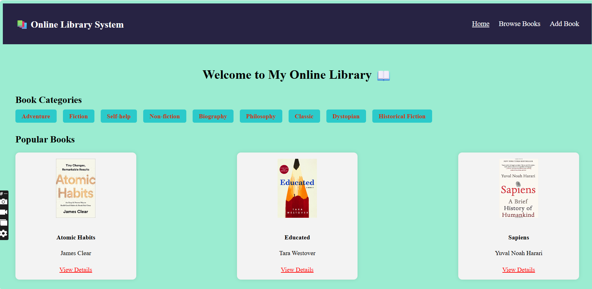

# 📚 Online Library System

A responsive and interactive **Online-library** application built with **React** + Vite project for 
browsing, viewing, and adding books using Redux,

## Features

- 📚 Home page with categories and popular books
- 🔍 Browse books by category or search by title/author
- 📘 Detailed view of each book
- ➕ Add new books with validation (Redux-managed state)
- 🚫 404 page for unknown routes.

## 📁 Project Structure
📁 src
│
├── 📁 components
│   └── 📄 Navbar.jsx # Navbar for the application  
│
├── 📁 pages
│   ├── 📄 AddBook.jsx  # for add books in application   
│   ├── 📄 BookDetails.jsx  # complete details of every book    
│   ├── 📄 BrowseBooks.jsx  # for Browsing of any book   
│   ├── 📄 Home.jsx   # main page of my application    
│   └── 📄 NotFound.jsx  # page not found and shows error message to the user   
│
├── 📁 redux
│   ├── 📄 bookSlice.js  #  dummy data of books for application   
│   └── 📄 store.js    # creating and configuring the global Redux store  
│   
├── 📄 App.jsx
├── 📄 main.jsx
└── 📄 index.css

## Tech Stack

- React
- React Router DOM
- Redux Toolkit
- Vite
- Plain CSS

## 🚀 Getting Started

### 1. Clone the Repository

#### bash
- git clone https://github.com/Arti2510/React-online-library.git   
- cd React-online-library

............

##  Install Dependencies

- Make sure you have Node.js installed.
- npm install
- npm run dev

🙋‍♀️ Author
GitHub: @Arti2510

📸 Project Screenshot

# React + Vite

This template provides a minimal setup to get React working in Vite with HMR and some ESLint rules.

Currently, two official plugins are available:

- [@vitejs/plugin-react](https://github.com/vitejs/vite-plugin-react/blob/main/packages/plugin-react) uses [Babel](https://babeljs.io/) for Fast Refresh
- [@vitejs/plugin-react-swc](https://github.com/vitejs/vite-plugin-react/blob/main/packages/plugin-react-swc) uses [SWC](https://swc.rs/) for Fast Refresh

## Expanding the ESLint configuration

If you are developing a production application, we recommend using TypeScript with type-aware lint rules enabled. Check out the [TS template](https://github.com/vitejs/vite/tree/main/packages/create-vite/template-react-ts) for information on how to integrate TypeScript and [`typescript-eslint`](https://typescript-eslint.io) in your project.
